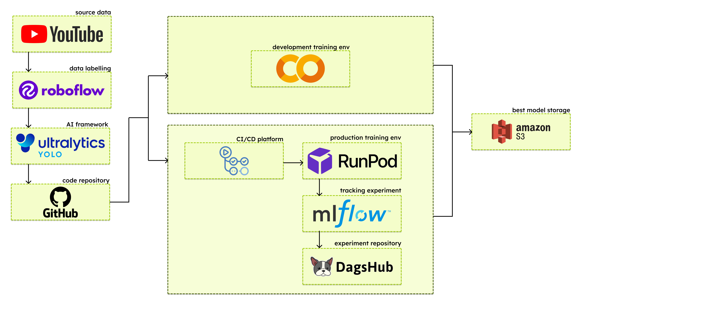

# 🎾 CourtPlay - AI Development & Research 🧪


## 👋 Halo, Selamat Datang di Dapur AI CourtPlay! 🍳🤖

Selamat datang di repository **CourtPlay AI Development**! 🎉

Kalau repository sebelah adalah "wajah" (Website) dan "otot" (Backend API) dari CourtPlay, nah di sini adalah **"otak"**-nya! 🧠✨ Di sini tempat kita ngoprek, eksperimen, training model, dan riset algoritma gila-gilaan buat bikin fitur analisis tenis yang super canggih.

Project ini fokus banget buat ngembangin Computer Vision yang bisa ngerti permainan tenis, mulai dari ngelacak bola sekecil itu, ngikutin gerakan pemain, sampe tau kapan bola mantul! 🤯🎾

---

## 🔗 Repository Tetangga

Jangan lupa mampir ke repository saudara-saudaranya ya, biar paham full context-nya:

*   🌐 **Website (Frontend & User Interface):** [CourtPlay Web](https://github.com/AbiyaMakruf/TelU-Tubes-BisnisDigital-CourtPlay-Web)  
    *Tempat user upload video dan liat hasil analisis yang cantik.*
*   ⚙️ **Backend AI Service:** [CourtPlay Backend](https://github.com/AbiyaMakruf/TelU-Tubes-BisnisDigital-CourtPlay-Backend)  
    *Service yang nge-serve model-model yang udah kita develop di sini ke production.*

---

## 🛠️ Tech Stack & Tools 🧰

Kita pake tools dan library yang powerful buat ngolah video dan gambar. Cekidot! 👇



*   **Language:** 🐍 Python (Wajib fardu ain buat AI).
*   **Computer Vision:** OpenCV, Scikit-Image.
*   **Deep Learning Framework:** PyTorch 🔥.
*   **Object Detection:** YOLO (Ultralytics) - Buat deteksi pemain & raket.
*   **Keypoint Detection:** Custom Models & YOLO - Buat deteksi lapangan.
*   **Tracking:** TrackNet (Custom) - Spesialis ngelacak bola tenis yang ngebut.
*   **Data Processing:** Pandas, Numpy, Scipy.
*   **Visualization:** Matplotlib.

### 🤝 Tools Pendukung Development
*   **DagsHub:** Buat version control data & model (GitHub-nya data scientist!). 🐶
*   **Roboflow:** Buat manage dataset, labeling, dan augmentasi gambar. 🖼️
*   **Google Colab / Kaggle:** Buat training model di cloud biar laptop gak meledak. ☁️💥

---

## ✨ Fitur-Fitur Canggih (AI Capabilities) 🧠

Di repository ini, kita ngembangin modul-modul pintar ini:

1.  **🎾 Ball Tracking:**
    *   Ngelacak posisi bola tenis frame-by-frame, bahkan pas bolanya lagi ngeblur karena cepet banget!
2.  **🏃 Player Tracking:**
    *   Deteksi pemain di lapangan dan ngikutin pergerakannya terus-menerus.
3.  **🗺️ Court Detection:**
    *   Ngenalin garis-garis lapangan tenis buat referensi koordinat (Homography). Jadi kita tau posisi real pemain di lapangan.
4.  **📉 Bounce Detection:**
    *   Nendeteksi momen pas bola nyentuh tanah (mantul). Penting banget buat analisis game!
5.  **🔥 Heatmap Generation:**
    *   Visualisasi area mana aja yang sering diinjek pemain atau dijatuhin bola.
6.  **📹 Scene Detection:**
    *   Mendeteksi potongan scene dalam video pertandingan.

---

## 🚀 Cara Jalanin (How to Run)

Mau coba jalanin di mesin kamu? Gaskeun! 🏎️

### 🏠 Di Local (Laptop Kamu)

1.  **Clone Repo ini:**
    ```bash
    git clone https://github.com/AbiyaMakruf/TelU-Tubes-BisnisDigital-CourtPlay-AIDevelopment.git
    cd TelU-Tubes-BisnisDigital-CourtPlay-AIDevelopment
    ```
2.  **Siapin Environment:**
    Disaranin pake virtual environment (conda/venv) biar rapi.
    ```bash
    # Contoh pake pip
    pip install -r Analytics-v2/requirements.txt
    ```
3.  **Jalanin Main Script:**
    Masuk ke folder `Analytics-v2` dan jalanin `main.py`. Pastiin kamu udah taruh video test di folder `test_videos`.
    ```bash
    cd Analytics-v2
    python main.py
    ```
    *Note: Cek `main.py` buat ganti nama video input ya!*

### ☁️ Di Cloud (Google Colab)

Kalau males setup local atau laptop kentang 🥔:
1.  Buka file `.ipynb` (Notebook) yang ada di folder `Analytics`, `KeyPoints`, atau `ObjectDetection`.
2.  Upload ke Google Colab.
3.  Upload dataset atau connect ke DagsHub/Roboflow.
4.  Run all cells! 🏃‍♂️

---

## 📸 Gallery & Showcase

Nih, liat hasil kerja keras kita! 😎

### 🖼️ Poster Project


### 📊 Output Analytics (Hasil AI)
Ini contoh output yang dihasilkan sama engine AI kita:

| Heatmap Player | Minimap Ball |
| :---: | :---: |
|  |  |

**Video Demo:**

*   **Full Output Analysis:** `output.mp4` (Cek di folder `README/output_analytics/`)
*   **Player Keypoints:** `playerKeyPoint.mp4`
*   **Heatmap Animation:** `heatmap_player.mp4`

### 🖥️ Tampilan Website (Admin & User)

Ini penampakan implementasi AI-nya di website CourtPlay:

#### 🏠 Landing Page & Auth
| Homepage | Login | Register |
| :---: | :---: | :---: |
|  |  |  |

#### 👤 User Dashboard & Features
| Profile | Upload Video | Analytics Result |
| :---: | :---: | :---: |
|  |  |  |

| Social Feed | Friend Profile | News Portal |
| :---: | :---: | :---: |
|  |  |  |

#### 👮 Admin Dashboard
| Dashboard 1 | Dashboard 2 | User Management |
| :---: | :---: | :---: |
|  |  |  |

---

**Created with ❤️ by CourtPlay Team**  
*Keep Smashing!* 🎾🚀